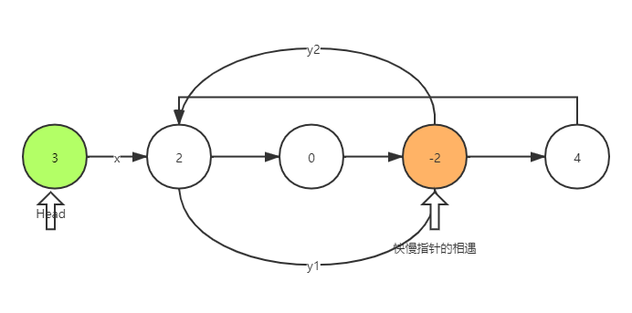

## 典型题型

### Min-Max
A,B 轮流选择一个队尾和队首的元素，当队列为空时，判断A,B谁拿取的总数最大
[StoneGame](src/main/java/com/leetcode/graph/StoneGame.kt)
### 规律
寻找数字间存在的规律，划分区间
[NumberOfDigitOne](src/main/java/com/offer/NumberOfDigitOne.kt)

### 正则表达式匹配[Complex]
使用递归模拟 ‘*’ 的匹配【状态机】，而不是常规的 while 匹配
注意如下的表达式：
```java
ture -> s= "aab" p= "c*a*b*"
true -> s="a"    p="ab*"
```
[RegularExpressionMatching](src/main/java/com/offer/RegularExpressionMatching.kt)

### 回溯法
回溯法适合由多个步骤组成的问题，每一个步骤都有多个选择，
如果用树形象的表示，在某一个节点有n个子节点，树的叶子节点为最终状态。
在当前叶子节点不满足约束时，回溯到上一个节点

#### 字典中回溯寻找单词
[WordSearch](src/main/java/com/offer/WordSearch.kt)

#### 全排序
[Permutations](src/main/java/com/offer/Permutations.kt)

### 双指针
#### 一维数组中使用双指针排序
[SortArrayByParity](src/main/java/com/offer/SortArrayByParity.kt)

#### 有环链表下快慢指针的特性
第一次快慢指针从 Head 节点出发，快指针走两步，慢指针走一步，在慢指针走到环头节点前，快慢指针就会相遇，
如下图中的-2
第一个快指针都过得路程为 x+y1+y2+y1
第二个满指针走过的路程为 x+y1
所以 x=y2
所以只需要在头节点和相遇节点共同走x步，就会一起到达环头节点


[LinkedListCycleII](src/main/java/com/offer/LinkedListCycleII.kt)

### Divide and conquer
#### 使用组合进行细节的封装
[ConvertBinarySearchTreeToSortedDoublyLinkedList](src/main/java/com/offer/ConvertBinarySearchTreeToSortedDoublyLinkedList.kt)


### SP
#### Dijkstra
[NetworkDelayTime](src/main/java/com/leetcode/graph/NetworkDelayTime.kt)

#### Bellman-Ford
[CheapestFlightsWithinKStops](src/main/java/com/leetcode/graph/CheapestFlightsWithinKStops.kt)

### DP
将大问题分解成小问题，求解每个子问题的最优解，从而求出大问题的解
> dp=缓冲数组+递归
[减绳子](src/main/java/com/offer/CutCord.kt)
> 无正确性

#### 自底向上回溯模拟
[DungeonGame](src/main/java/com/leetcode/dp/DungeonGame.kt)

#### [hard][DP]
**[BurstBalloons](src/main/java/com/leetcode/dp/BurstBalloons.kt)**
> 逆向思维思考子步骤

#### 特殊形状的图形 [DP]
* 求最大面积正方形： **[MaximalSquare](src/main/java/com/leetcode/dp/MaximalSquare.kt)**
* 求二维矩形内某一个形状的和 [RangeSumQuery2D](src/main/java/com/leetcode/dp/RangeSumQuery2D.kt)

### Kotlin 使用
#### 谨慎 if 表达式
[carefulIfExpression](src/test/java/com/IfExpression.kt)
```kotlin
private fun add(i: Int, j: Int): Int = 2 + if (i == 1) 0 else i + if (j == 1) 0 else j
```
中 + 操作符优先于 return , 实际为
```java
   private final int add(int i, int j) {
      return  2 + (i == 1 ? 0 : i + (j == 1 ? 0 : j));
   }
```
正确写法
```kotlin
    private fun add(i: Int, j: Int): Int = 2 + if (i == 1) 0 else {
        i
    } + if (j == 1) 0 else j
```

