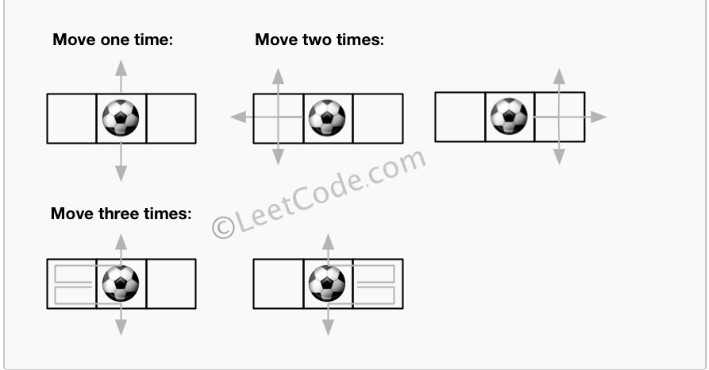

## 典型题型

### Min-Max
A,B 轮流选择一个队尾和队首的元素，当队列为空时，判断A,B谁拿取的总数最大

[StoneGame](src/main/java/com/leetcode/graph/StoneGame.kt)
给定一个数组，Alex 每次从数组的最左边或者最右边挑选一个，Lee 也是同样的操作，每次每人的选择都是最优的<br>
求最后的输赢关系

*Example 1:*

```
Input: [5,3,4,5]
Output: true
Explanation: 
Alex starts first, and can only take the first 5 or the last 5.
Say he takes the first 5, so that the row becomes [3, 4, 5].
If Lee takes 3, then the board is [4, 5], and Alex takes 5 to win with 10 points.
If Lee takes the last 5, then the board is [3, 4], and Alex takes 4 to win with 9 points.
This demonstrated that taking the first 5 was a winning move for Alex, so we return true.
```

<hr>

### 规律
寻找数字间存在的规律，划分区间

[NumberOfDigitOne](src/main/java/com/offer/NumberOfDigitOne.kt)
给定一个n，求 [1,n] 区间内，1 出现的次数
> Example： <br>
> Input: 13 <br>
>Output: 6 <br>
>Explanation: Digit 1 occurred in the following numbers: 1, 10, 11, 12, 13.

[NthDigit](src/main/java/com/offer/NthDigit.kt) 
给定一个无限长的字符串，规律是 123456789101112..x(x+1)...n<br>
求第 n 个数字 所在的整数x
>Input: 11 <br>
>Output: 0 <br>
> Explanation:
 The 11th digit of the sequence 1, 2, 3, 4, 5, 6, 7, 8, 9, 10, 11, ... is a 0, which is part of the number 10.


[丑数](src/main/java/com/offer/UglyNumberII.kt): 2<sup>i</sup>3<sup>j</sup>5<sup>k</sup><br>
求第 n 个丑数
> Input: n=10 <br>
> Output: 12 <br>
> Explanation: 1, 2, 3, 4, 5, 6, 8, 9, 10, 12 is the sequence of the first 10 ugly numbers.


#### N数之和
##### [Two Sum](src/main/java/com/offer/TwoSum.kt)

Given an array of integers, return **indices** of the two numbers such that they add up to a specific target.

**Example:**

```
Given nums = [2, 7, 11, 15], target = 9,

Because nums[0] + nums[1] = 2 + 7 = 9,
return [0, 1].
```

### [3Sum](src/main/java/com/leetcode/top/interview/medium/ThreesSum.java)

Given an array `nums` of _n_ integers, are there elements _a_, _b_, _c_ in `nums` such that _a_ + _b_ + _c_ = 0? Find all unique triplets in the array which gives the sum of zero.

**Example:**

```
Given array nums = [-1, 0, 1, 2, -1, -4],

A solution set is:
[
  [-1, 0, 1],
  [-1, -1, 2]
]
```


#### 值二分法
> 求最大化的最小值、最小化的最大值问题，通过预测目标结果，进行决策
Rick 有 n 个空的篮子，第 i 个篮子的位置在 position[i] ，Morty 想把 m 个球放到这些篮子里，使得任意两球间 最小磁力 最大。
> 已知两个球如果分别位于x和y，那么它们之间的磁力为|x - y
>
> 给你一个整数数组position和一个整数m，请你返回最大化的最小磁力
>

```
输入：position = [1,2,3,4,7], m = 3
输出：3
解释：将 3 个球分别放入位于 1，4 和 7 的三个篮子，两球间的磁力分别为 [3, 3, 6]
最小磁力为 3 
```

[最小磁力](src/main/java/com/code/leetcode/SmallestMagnetic.java)

相关题型：
> [寻找两个正序数组的中位数](src/main/java/com/leetcode/bs/MedianOfTwoSortedArrays.java)

#### 位运算[Single Number](src/main/java/com/leetcode/aprilchallenge/SingleInteger.java)
> todo: 进阶版[Single NumberIII](https://leetcode.com/problems/single-number-iii/)
> todo: 进阶版[Single NumberIV](剑指Offer)


Given a **non-empty** array of integers, every element appears _twice_ except for one. Find that single one.

**Example :**

```
Input: [2,2,1]
Output: 1
```

<hr>

### 排序的变种(O(n<sup>2</sup>)算法时考虑)
1. 基于归并排序的递归回退思路，从小数组到大数组
2. 基于快排分治的思路，将数组划分成左右数组
> 当在数组中使用 O(n<sup>2</sub>)的时间复杂度时，可以考虑使用排序的变种

#### 归并 [Reverse Pairs](src/main/java/com/offer/ReversePairs.kt)

Given an array `nums`, we call `(i, j)` an **_important reverse pair_** if `i < j` and `nums[i] > 2*nums[j]`.

You need to return the number of important reverse pairs in the given array.

**Example1:**

```
Input: [1,3,2,3,1]
Output: 2
```

#### 快排[SequenceSortPlagiarism](src/main/java/com/code/cts/SequenceSortPlagiarism.java)

给定一个序列，按照 output的顺序进行输出：
```
Input: 
9
25 84 21 47 15 27 68 35 20
output:
  15 20 21 25 47 27 68 35 84
  15 20 21 25 47 27 68 35 84
  15 20 21 25 47 27 68 35 84
  15 20 21 25 35 27 47 68 84
  15 20 21 25 27 35 47 68 84
  15 20 21 25 27 35 47 68 84
```


### 二分查找(有序 O(n))
> 基于二分的思想，将 O(n) 变成 O(NlogN)
#### [Find First and Last Position of Element in Sorted Array](src/main/java/com/offer/FindFirstAndLastPositionOfElementInSortedArray.kt)

给定一个有序递增数组，查找目标 `target` 的最左端和最右端

**Example 1:**

```
Input: nums = [5,7,7,8,8,10], target = 8
Output: [3,4]
```
#### [数组中数值和下标相等的元素](src/main/java/com/offer/NumsEqualsSubscript.kt)
假设一个单调递增的数组里的每个元素都是整数并且是唯一的。

实现一个函数找出数组中任意一个数值等于其下标的元素。

**Example:**

```
Input: nums = [-3, -1, 1, 3, 5]
Output: 3
```

### 二叉树的查找
1. 前序遍历的利用
2. 中序遍历的利用
3. 后序遍历的利用[需要对左右子树先行进行特殊处理]

#### 非递归前序遍历[树的最大深度](src/main/java/com/offer/MaximumDepthOfBinaryTree.kt)

Given a binary tree, find its maximum depth.

**Example:**

```
Input:
    3
   / \
  9  20
    /  \
   15   7

output: 3
```


#### 非递归中序遍历[Kth Smallest Element in a BST](src/main/java/com/offer/KthSmallestElementInABST.kt)

Given a binary search tree, write a function `kthSmallest` to find the **k**th smallest element in it.

**Example:**

```
Input: root = [3,1,4,null,2], k = 1
   3
  / \
 1   4
  \
  2
Output: 1
```

#### 递归后序遍历[检查是否是平衡二叉树](src/main/java/com/offer/KthSmallestElementInABST.kt)

给定一棵二叉树，判断该树是不是平衡二叉树
> 任意左右子树，高度差不大于1

**Example:**

```
Input: root = [3,3,8,null,4]
   5
  / \
 3   8
  \
  4
Output: true
```

### 回溯法
回溯法适合由多个步骤组成的问题，每一个步骤都有多个选择，
如果用树形象的表示，在某一个节点有n个子节点，树的叶子节点为最终状态。
在当前叶子节点不满足约束时，回溯到上一个节点

#### 字典中回溯寻找单词
[WordSearch](src/main/java/com/offer/WordSearch.kt)

#### 数字全排序
[Permutations](src/main/java/com/offer/Permutations.kt)

### 双指针
#### 一维数组中使用双指针排序
[SortArrayByParity](src/main/java/com/offer/SortArrayByParity.kt)

### LinkedList
* 快慢指针寻找中间节点
第一次快慢指针从 Head 节点出发，快指针走两步，慢指针走一步，在慢指针走到环头节点前，快慢指针就会相遇，

>  令 头节点到环形入口节点 长度为a,环形长度为 b 
> 
> 令 fast 指针走 f 步，slow 指针走 s 步，则 f=2s
>
> 由于存在环，两个指针速度差距为1，则 fast = nb + s = 2s
>
> 则 s=nb 
>
> 考虑一种新的情况，一个节点走 a+ nb ，那么该节点一定会走到环形入口处
> 综上，在两指针相遇后，slow 走了nb步，此时在走a步就可以到达环形入口处，此时用
>另一个指针从 head 节点出发走 a 步，则两指针会在环形入口处相遇


[LinkedListCycleII](src/main/java/com/offer/LinkedListCycleII.kt)
* [链表的反转](src/main/java/com/leetcode/graph/ReverseLinkedList.kt)

[Palindrome Linked List 两者的结合](src/main/java/com/leetcode/linked/PalindromeLinkedList.kt)


### SP
#### Dijkstra
[NetworkDelayTime](src/main/java/com/leetcode/graph/NetworkDelayTime.kt)

#### Bellman-Ford
[CheapestFlightsWithinKStops](src/main/java/com/leetcode/graph/CheapestFlightsWithinKStops.kt)

### DP
将大问题分解成小问题，求解每个子问题的最优解，从而求出大问题的解
1. 每个子问题都有最优解且不会改变
2. 同样的子问题会重复出现
> 无重复就退化成了 divide and conquer
* 使用递归方式【计划递归】
* 使用循环 【动态规划】

* I: 输入规模
* S: 子问题规模
* D: 依赖规模
> https://www.youtube.com/watch?v=eLlZEYzZVyQ
#### I(n) S(n) D(1)
> D(1) 即依赖于有限个解
**[DominoAndTrominoTiling](src/main/java/com/leetcode/dp/limited/DominoAndTrominoTiling.kt)**

使用如下： 一 和 L 型 进行覆盖2 *N 的面板

```
XX  <- domino

XX  <- "L" tromino
X
```
Given N, how many ways are there to tile a 2 x N board? **Return your answer modulo 10^9 + 7**.

```
Example:
Input: 3
Output: 5
Explanation:
The five different ways are listed below, different letters indicates different tiles:
XYZ XXZ XYY XXY XYY
XYZ YYZ XZZ XYY XXY
```
> 类似题型：
>
> [Climbing Stairs](src/main/java/com/leetcode/dp/limited/ClimbingStairs.java)
>
> [MinCostClimbingStairs](src/main/java/com/leetcode/dp/limited/MinCostClimbingStairs.java)
>
> [House Robber](src/main/java/com/leetcode/dp/limited/HouseRobber.java)
>
> [UniquePaths](src/main/java/com/leetcode/dp/limited/UniquePaths.java)
>
> 交换数组序列【Hard】[MinimumSwapsToMakeSequencesIncreasing](src/main/java/com/leetcode/dp/limited/MinimumSwapsToMakeSequencesIncreasing.kt)
>
> 反转字符'0' 和 ’1‘[FlipStringToMonotoneIncreasing](src/main/java/com/leetcode/dp/limited/FlipStringToMonotoneIncreasing.kt)
>

#### I(n) S(n) D(n)
> D(n) 依赖于所有比当前 N 规模小的子问题

[Word Break]()

Given a **non-empty** string _s_ and a dictionary _wordDict_ 
containing a list of **non-empty** words, determine if _s_
 can be segmented into a space-separated sequence of one or more dictionary words.

**Example 1:**

```
Input: s = "leetcode", wordDict = ["leet", "code"]
Output: true
Explanation: Return true because "leetcode" can be segmented as "leet code".
```

**Example 2:**

```
Input: s = "applepenapple", wordDict = ["apple", "pen"]
Output: true
Explanation: Return true because "applepenapple" can be segmented as "apple pen apple".
            Note that you are allowed to reuse a dictionary word.
```

#### I(n) S(n<sup>2</sup>) D(i..j)
> D(i..j) 依赖与 i..j 内的全部子问题，dp(i,j) 主要依赖于 dp(i,j),dp(i,k),dp(k,j)
>
> S(n<sup>2</sup> ) 每个子问题都需要 O(n) 的时间复杂度

[BurstBalloons](src/main/java/com/leetcode/dp/BurstBalloons.kt)

Given n balloons, indexed from 0 to n-1.

Each balloon is painted with a number on it represented by array nums.
You are asked to burst all the balloons.

If the you burst balloon i you will get nums[left] * nums[i] * nums[right] coins.

Here left and right are adjacent indices of i. After the burst, the left and right then becomes adjacent.

Find the maximum coins you can collect by bursting the balloons wisely.
  
Example1：

```
Input: [3,1,5,8]
Output: 167
```
> 类似题目：
>
>[StrangePrinter](src/main/java/com/leetcode/dp/StrangePrinter.kt)
>
> 划分成两个和相等的子序列【0-1背包问题】[PartitionEqualSubsetSum](src/main/java/com/leetcode/dp/knapsack/PartitionEqualSubsetSum.kt)
>
> [给定金额求有多少种组合【完全背包问题】](src/main/java/com/leetcode/dp/knapsack/CoinChange2.kt)
> [给定金额求硬币的最少数量【完全背包问题】](src/main/java/com/leetcode/dp/knapsack/CoinChange.kt)
#### I(O(m)+O(n))  S(MN) D(1)
> I(O(m)+O(n)) 两个数组或字符串
> S(MN) 二维dp 且通常依赖 dp[i-1][j-1]||dp[i-1][j]||dp[i][j-1]

**[EditDistance](src/main/java/com/leetcode/dp/EditDistance.kt)**

Given two words _word1_ and _word2_, find the minimum number of operations required to convert _word1_ to _word2_.

You have the following 3 operations permitted on a word:

1.  Insert a character
2.  Delete a character
3.  Replace a character

 **Example 1:**

```
Input: word1 = "horse", word2 = "ros"
Output: 3
Explanation:
horse -> rorse (replace 'h' with 'r')
rorse -> rose (remove 'r')
rose -> ros (remove 'e')
```

 **Example 2:**

```
Input: word1 = "intention", word2 = "execution"
Output: 5
Explanation:
intention -> inention (remove 't')
inention -> enention (replace 'i' with 'e')
enention -> exention (replace 'n' with 'x')
exention -> exection (replace 'n' with 'c')
exection -> execution (insert 'u')
```

> 类似题型：
>[Minimum ASCII Delete Sum for Two Strings]()

#### I(MN) S(MN) D(1)

**[Unique Paths](src/main/java/com/leetcode/dp/limited/UniquePaths.java)**

A robot is located at the top-left corner of a _m_ x _n_ grid (marked 'Start' in the diagram below).

The robot can only move either down or right at any point in time. The robot is trying to reach the bottom-right corner of the grid (marked 'Finish' in the diagram below).

How many possible unique paths are there?

**Example :**

```
Input: m = 3, n = 2
Output: 3
Explanation:
From the top-left corner, there are a total of 3 ways to reach the bottom-right corner:
1\. Right -> Right -> Down
2\. Right -> Down -> Right
3\. Down -> Right -> Right
```

>类似题型
> * 求最大面积正方形： **[MaximalSquare](src/main/java/com/leetcode/dp/MaximalSquare.kt)**
> * 求二维矩形内某一个形状的和 [RangeSumQuery2D](src/main/java/com/leetcode/dp/RangeSumQuery2D.kt)

#### I(MN) S(MN) D(NN)[k,i,j]
> dp(k,i,j) := sol of (A[0->i][0->j] after k steps) 
> 只依赖于 1个子问题

**[Out of Boundary Paths](src/main/java/com/leetcode/dp/OutOfBoundaryPaths.kt)**

There is an **m** by **n** grid with a ball. Given the start coordinate **(i,j)** of the ball, you can move the ball to **adjacent** cell or cross the grid boundary in four directions (up, down, left, right). However, you can **at most** move **N** times. Find out the number of paths to move the ball out of grid boundary. The answer may be very large, return it after mod 10<sup>9</sup> + 7.

**Example :**

```
Input: m = 1, n = 3, N = 3, i = 0, j = 1
Output: 12
Explanation:
```



## 数据结构
### [跳表](https://lotabout.me/2018/skip-list/)

跳表的构建过程
1. 在插入过程中，只保证向下和向左查找
2. 直到最下层中找到插入位置，将target 置成随机层高，如果当前随机层高大于当前最大层高，则从head中的每一层的末尾指向当前target
[自我丑陋版SkipList](src/main/java/com/CollectionsUtil.kt)


### 并查集
使用一个数组保存各节点之间的连接信息，可以用来判断给定的节点是否存在环路
[简陋版UF](src/main/java/com/UF.kt)


## Kotlin 使用
#### 谨慎 if 表达式
[carefulIfExpression](src/test/java/com/IfExpression.kt)
```kotlin
private fun add(i: Int, j: Int): Int = 2 + if (i == 1) 0 else i + if (j == 1) 0 else j
```
中 + 操作符优先于 return , 实际为
```java
   private final int add(int i, int j) {
      return  2 + (i == 1 ? 0 : i + (j == 1 ? 0 : j));
   }
```
正确写法
```kotlin
    private fun add(i: Int, j: Int): Int = 2 + if (i == 1) 0 else {
        i
    } + if (j == 1) 0 else j
```

